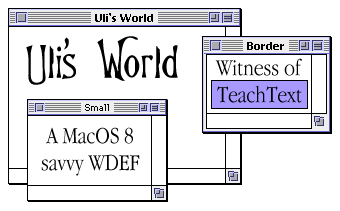

Uli's World 2.5.1
=================



What's this garbage??
---------------------

Uli's World is a replacement for the MacOS 8 System WDEF (ID 64). It replaces the window frames with the good old System 7 look which takes up much less space than the new 'thick border' Apple Greyscale appearance.

It is based upon my old Uli's World WDEF which did quite the opposite: Implement a 'thick border' Copland-ish WDEF for System 7.


Cool MacOS 8 features:
----------------------

Even though the Uli's World WDEF sports a look that is very similar to the windows in MacOS 7.5 and lower, it supports all of MacOS 8's new features like horizontal and vertical zoom boxes and a collapse box. I tried to make it behave exactly like the original. Note that Uli's World only changes the windows for documents, but neither dialogs nor alert windows nor utility palettes (aka floating windows).

If you paste an Uli's New World WDEF (the 68k or PPC version, depending on the type of Mac you're using) into a copy of your 'Appearance Extension' and you then put this copy into your extensions folder instead of the original one, you should see the good old System 7 windows instead of the large grey ones.

The only thing that is not yet implemented are the MacOS 8.5 proxy icons (the nifty icons in the title bar).

Variation codes and Variants:
-----------------------------

Uli's World comes in three flavours: System 7 Window, System 7 Window with thick borders (looks a bit like the movable dialogs in System 7), and Small system 7 Window with Geneva 9 as text font for the title.


Source Code
-----------
The source code for Uli's World is included as well, so Macintosh developers can use it to generate their own MacOS 8-savvy WDEFs (without support for themes, that is). The new source is much tidier than the source of the old Uli's World WDEFs and includes loads of constants and readymade code that will be of use in any WDEF.


Thanx to:
---------

Tom Reahard - He provided the fungicide for the bug in CheckColor.

Gregory Lemperle-Kerr - He provided some Code for the CodeWarrior move.

Troy Gaul - Her Infinity Windoid code was a great source for information.

Apple "MacOS 8 Toolbox Ref" team - If you ever describe anything as bad as you did with the feature request code, I'll shoot you! &lt;g&gt;


Uli's World © 1998 Uli Kusterer.
